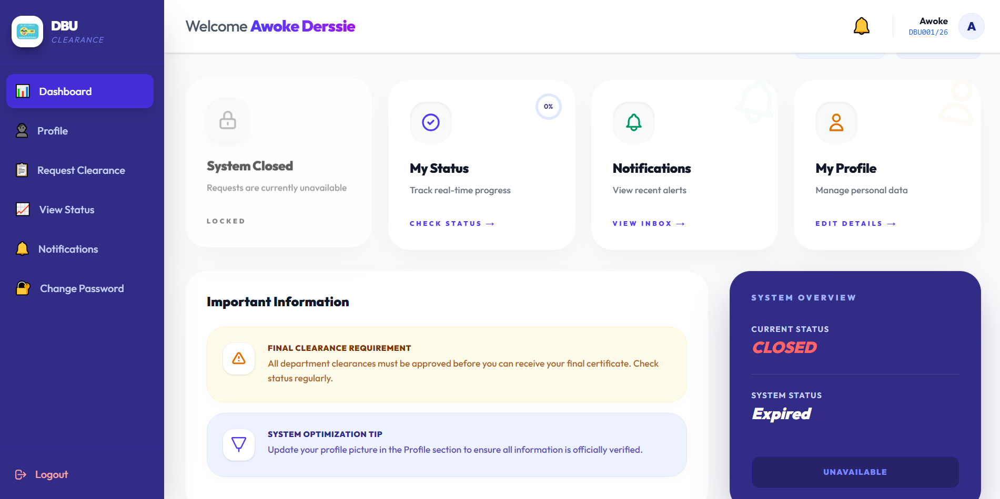
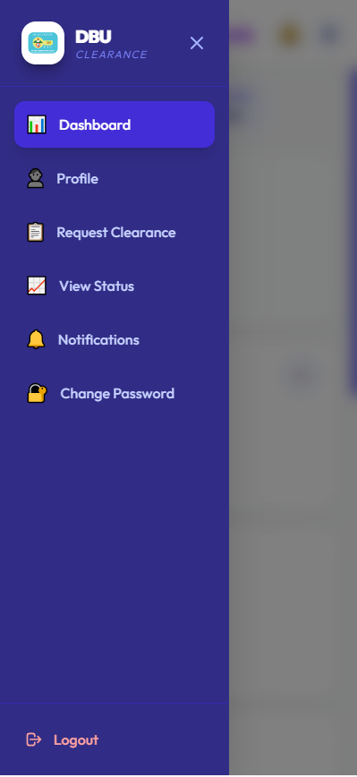

# Awoke Derssie | Portfolio Website

Welcome to my personal portfolio repository! This responsive, dynamic website showcases my skills, experience, and projects as a Full-Stack Developer and UI/UX Designer. It is built using modern web development practices with a strong focus on aesthetics and performance.

## 🌟 Live Demo
[View Live Site](https://awoked-portfolio.netlify.app/)

## ✨ Features
- **Modern UI/UX Design**: Built with a stunning dark/indigo gradient color palette, frosted glassmorphism elements, and smooth modern typography (`Poppins`).
- **Fully Responsive**: perfectly scalable on desktops, tablets, and mobile devices with a custom hamburger navigation menu.
- **High-Performance Animations**: Utilizes modern `IntersectionObserver` APIs for buttery smooth scroll animations and fade-ins without impacting browser frame rates.
- **Dynamic Content**: Active state navigation tracking and automated footer year updating via JavaScript.
- **Projects Showcase**: Interactive project cards showcasing live previews of my work (e.g., student clearance systems, dynamic e-commerce solutions).
- **Direct Contact**: Easily accessible email functionality for seamless communication.

## 📷 Screenshots

 


## 💡 Skills

- **Frontend:** HTML, CSS, JavaScript, React
- **Backend:** Node.js, Express, PHP
- **Database:** MySQL
- **Tools:** Git, GitHub, Figma

## 📂 Featured Projects

### 🎓 Student Clearance Management System
A comprehensive web-based system developed to automate the student clearance process at Debre Berhan University. It synchronizes multiple departments, allowing seamless review, approval, and rejection of student clearance requests.
- **Technologies:** Node.js with Express, PostgreSQL, React, Tailwind CSS
- **Live Link:** [dbu-clearance-system.onrender.com](https://dbu-clearance-system.onrender.com)

### 🍔 Online Food Delivery Platform
A dynamic full-stack web application designed for interactive food ordering. Features include a user-friendly menu, cart processing, and a dedicated administrative panel to manage restaurant offerings and customer orders efficiently.
- **Technologies:** PHP, MySQL, HTML, CSS, JavaScript
- **Live Link:** [awoke.infy.uk/food-order](http://awoke.infy.uk/food-order/index.php)

## 🛠️ Built With
- **HTML5** (semantic structure)
- **CSS3** (custom properties, Flexbox, Grid, advanced animations)
- **Vanilla JavaScript** (IntersectionObserver, DOM manipulation, custom typing animation without heavy libraries)

## 📂 Project Structure
```
├── index.html       # Main HTML structure and content
├── style.css        # Core styling, variables, layout, and cross-browser prefixes
├── javascript.js    # Interactivity, custom animations, and automated functionality
└── images/          # Assets, project thumbnails, and vector icons
```

## 🚀 Getting Started Locally

1. Clone this repository to your local machine:
   ```bash
   git clone https://github.com/awokedersie/portfolio.git
   ```
2. Navigate to the project directory:
   ```bash
   cd portfolio
   ```
3. Open `index.html` in your favorite web browser! No local build server required, this project uses vanilla technologies for maximum portability.

## 📫 Contact Me

If you'd like to reach out, collaborate on a project, or just say hello:
- **Email**: [awokedersie@gmail.com](mailto:awokedersie@gmail.com)
- **GitHub**: [Awoke-hub](https://github.com/Awoke-hub)

---

*Designed and developed with 💻 by Awoke Derssie.*
